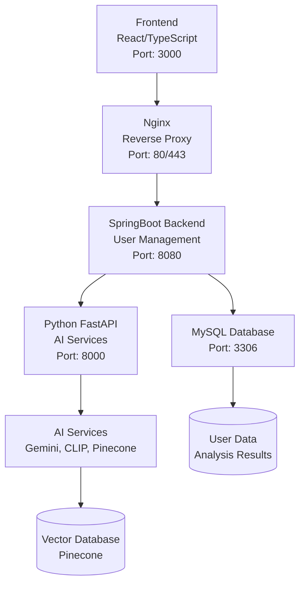

# MOZARA - 모발 손상 분석 시스템

## 🏗️ 시스템 아키텍처

### 📊 전체 구조도


### 🔄 요청 처리 흐름

dd
#### 1️⃣ **AI 기능 요청 시**
```
[Frontend] 
    ↓ (HTTPS 요청)
[Nginx Proxy]
    ↓ (/api/* 라우팅)
[SpringBoot Backend]
    ↓ (AI 기능 판별)
[Python FastAPI]
    ↓ (AI 모델 처리)
[AI Services]
    ↓ (결과 반환)
[SpringBoot Backend]
    ↓ (결과 수신 및 DB 저장)
[Frontend]
    (결과 표시)
```

#### 2️⃣ **일반 기능 요청 시**
```
[Frontend]
    ↓ (HTTPS 요청)
[Nginx Proxy]
    ↓ (/api/* 라우팅)
[SpringBoot Backend]
    ↓ (DB 처리)
[MySQL Database]
    ↓ (결과 반환)
[Frontend]
    (결과 표시)
```

## 🛠️ 기술 스택

### Frontend
- **Language**: TypeScript
- **Framework**: React
- **Styling**: Tailwind CSS
- **State Management**: Redux Toolkit

### Backend (Main - Spring Boot)
- **Language**: Java
- **Framework**: Spring Boot
- **Security**: Spring Security + JWT
- **Architecture**: RESTful API, MVC Pattern
- **Build Tool**: Gradle
- **Containerization**: Docker

### Backend (AI - FastAPI)
- **Language**: Python 3.10+
- **Framework**: FastAPI
- **AI/ML Services**:
  - **Gemini 2.5 Flash**: 빠른 탈모 분석, 이미지 생성, RAG 답변 생성, 논문 요약
  - **Swin Transformer**: 정밀 탈모 단계 분류 (Top/Side 이미지 분석)
  - **BiSeNet**: 얼굴 파싱 및 두피 영역 분할 (시계열 분석)
  - **CLIP Model**: 이미지 벡터화 및 유사도 검색
  - **LangChain**: RAG 체인 구성 및 메모리 관리
  - **Pinecone**: 벡터 데이터베이스 (논문, 탈모 사례, 백과사전 데이터)
  - **PubMed API**: 의료 논문 자동 수집
- **Architecture**: Microservice, API Gateway Pattern
- **Containerization**: Docker
- **ML Frameworks**: PyTorch, Transformers, OpenCV

### Infrastructure & DevOps
- **Containerization**: Docker + Docker Compose
- **Reverse Proxy**: Nginx (HTTPS, SSL/TLS)
- **Database**: MySQL 8.0
- **CI/CD**: GitHub Actions
- **Deployment**: AWS EC2
- **Domain**: DuckDNS (동적 DNS)
- **SSL**: Let's Encrypt (Certbot)

## 📁 프로젝트 구조

```
project/
├── frontend/                         # React (TypeScript)
│   ├── src/
│   │   ├── assets/        # 정적 리소스 (이미지, 폰트, 아이콘)
│   │   │   └── icon/      # SVG 아이콘
│   │   ├── components/    # 재사용 가능한 UI 컴포넌트
│   │   │   ├── ui/         # shadcn/ui 기반 기본 컴포넌트
│   │   │   ├── ErrorBoundary.tsx  # 에러 처리
│   │   │   ├── PlantGrowth.tsx    # 새싹 성장 애니메이션
│   │   │   ├── LikeButton.tsx     # 즐겨찾기 버튼
│   │   │   ├── Header.tsx         # 헤더
│   │   │   ├── Footer.tsx         # 푸터
│   │   │   └── BottomNavigationBar.tsx  # 하단 네비게이션
│   │   ├── pages/         # 라우팅되는 페이지 단위
│   │   │   ├── check/      # 탈모 진단 관련
│   │   │   │   ├── IntegratedDiagnosis.tsx  # 통합 진단
│   │   │   │   ├── DiagnosisResults.tsx     # 진단 결과
│   │   │   │   ├── HairDiagnosis.tsx        # 구버전 진단
│   │   │   │   └── result/                  # 결과 탭 컴포넌트
│   │   │   ├── hair_dailycare/  # 일상 관리
│   │   │   │   ├── Dashboard.tsx           # 대시보드
│   │   │   │   ├── DailyCare.tsx           # 일일 케어
│   │   │   │   ├── ProgressTracking.tsx    # 진행 상황 추적
│   │   │   │   └── WeeklyChallenges.tsx    # 주간 챌린지
│   │   │   ├── hair_change/     # 헤어 스타일 변경
│   │   │   │   ├── HairChange.tsx
│   │   │   │   └── VirtualHairstyle.tsx
│   │   │   ├── hair_product/    # 제품 추천
│   │   │   ├── hair_pt/         # 포인트 시스템
│   │   │   ├── hair_map/        # 탈모 맵
│   │   │   ├── hair_tube/       # YouTube 영상
│   │   │   ├── hair_ox/         # OX 퀴즈
│   │   │   ├── hairEncyclopedia/ # 탈모 백과사전
│   │   │   │   ├── components/   # 백과사전 컴포넌트
│   │   │   │   └── HairEncyclopediaMain.tsx
│   │   │   ├── ChatBot/         # 챗봇
│   │   │   │   ├── Chat.tsx
│   │   │   │   ├── ChatBotModal.tsx
│   │   │   │   └── ChatBotMessenger.tsx
│   │   │   ├── timeseries/      # 시계열 분석
│   │   │   ├── mypage/          # 마이페이지
│   │   │   ├── admin/           # 관리자 페이지
│   │   │   ├── users/           # 로그인/회원가입
│   │   │   ├── LandingPage.tsx  # 랜딩 페이지
│   │   │   ├── MainPage.tsx     # 메인 페이지
│   │   │   └── MainLayout.tsx   # 레이아웃
│   │   ├── services/      # API 통신 서비스
│   │   │   ├── apiClient.ts              # Axios 클라이언트
│   │   │   ├── pythonClient.ts           # Python API 클라이언트
│   │   │   ├── configApi.ts              # 설정 API
│   │   │   ├── ragAnalysisService.ts     # RAG 분석 서비스
│   │   │   ├── swinAnalysisService.ts    # Swin 분석 서비스
│   │   │   ├── geminiAnalysisService.ts  # Gemini 분석 서비스
│   │   │   ├── hairChangeService.tsx     # 헤어 체인지 서비스
│   │   │   ├── hairProductApi.ts         # 제품 API
│   │   │   ├── weatherService.ts         # 날씨 API
│   │   │   ├── locationService.ts        # 위치 API
│   │   │   └── elevenStApi.ts            # 11번가 API
│   │   ├── utils/         # 유틸리티 및 상태 관리
│   │   │   ├── store.ts                  # Redux Store
│   │   │   ├── userSlice.ts              # 사용자 상태
│   │   │   ├── tokenSlice.ts             # 토큰 상태
│   │   │   ├── seedlingSlice.ts          # 새싹 상태
│   │   │   ├── hairProductSlice.ts       # 제품 상태
│   │   │   ├── missionCounterSlice.ts    # 미션 카운터
│   │   │   ├── dateFormatter.ts          # 날짜 포맷
│   │   │   ├── hairLossStages.ts         # 탈모 단계 정의
│   │   │   └── data/                     # 정적 데이터
│   │   ├── hooks/         # 커스텀 훅
│   │   │   ├── useScrollAnimation.ts
│   │   │   └── ImageWithFallback.tsx
│   │   ├── App.tsx        # 메인 앱
│   │   └── index.tsx      # 엔트리 포인트
│   └── package.json
│
├── backend/
│   ├── springboot/        # 메인 백엔드 (Spring Boot)
│   │   ├── src/
│   │   │   └── main/
│   │   │       ├── java/
│   │   │       │   └── com/example/springboot/
│   │   │       │       ├── component/     # 보안 컴포넌트
│   │   │       │       ├── config/        # 설정 (Security, CORS 등)
│   │   │       │       ├── controller/    # REST 컨트롤러
│   │   │       │       │   ├── ai/        # AI 관련 컨트롤러
│   │   │       │       │   ├── habit/     # 습관 관리 컨트롤러
│   │   │       │       │   └── user/      # 사용자 컨트롤러
│   │   │       │       ├── data/          # 데이터 계층
│   │   │       │       │   ├── dao/       # 데이터 접근 객체
│   │   │       │       │   ├── dto/       # 데이터 전송 객체
│   │   │       │       │   ├── entity/    # 엔티티
│   │   │       │       │   └── repository/ # JPA 리포지토리
│   │   │       │       ├── exception/     # 예외 처리
│   │   │       │       ├── jwt/           # JWT 인증
│   │   │       │       ├── service/       # 비즈니스 로직
│   │   │       │       │   ├── ai/        # AI 서비스
│   │   │       │       │   ├── habit/     # 습관 관리 서비스
│   │   │       │       │   └── user/      # 사용자 서비스
│   │   │       │       └── SpringbootApplication.java
│   │   │       └── resources/
│   │   │           └── application.properties
│   │   ├── build.gradle
│   │   ├── Dockerfile
│   │   └── gradlew
│   │
│   └── python/            # AI 백엔드 (FastAPI)
│       ├── app.py         # FastAPI 메인 애플리케이션 (통합 서버)
│       ├── requirements.txt
│       ├── Dockerfile
│       ├── pinecone_data/ # Pinecone 데이터 생성 및 관리
│       └── services/      # AI 서비스 모듈들
│           ├── hair_change/              # 헤어스타일 변경 (Gemini)
│           ├── hair_classification_rag/  # RAG 기반 탈모 분석
│           │   ├── api/                  # API 라우터
│           │   ├── config/               # 설정 (Ensemble, Pinecone)
│           │   ├── models/               # 데이터 모델
│           │   └── services/             # 분석 서비스
│           ├── hair_loss_daily/          # CLIP 기반 두피 상태 일일 분석
│           │   ├── api/                  # API 라우터
│           │   ├── models/               # 데이터 모델
│           │   ├── services/             # AI 분석 서비스
│           │   └── utils/                # 유틸리티
│           ├── hair_encyclopedia/        # 탈모 백과사전
│           │   ├── hair_papers/          # PubMed 논문 수집
│           │   └── paper_api.py          # 논문 API 라우터
│           ├── hair_loss_products/       # 제품 추천 시스템
│           ├── hair_quiz/                # OX 퀴즈 생성 (Gemini)
│           ├── hair_daily_care_weather/  # 날씨 기반 두피 케어
│           ├── rag_chatbot/              # RAG 챗봇 (LangChain)
│           ├── swin_hair_classification/ # Swin Transformer 분석
│           │   ├── models/               # Swin 모델 및 BiSeNet
│           │   └── hair_swin_check.py    # Swin 분석 메인
│           ├── time_series/              # 시계열 분석
│           │   ├── api/                  # API 라우터
│           │   ├── models/               # 데이터 모델
│           │   └── services/             # 밀도 분석, 비교 서비스
│           ├── hair_gemini_check.py      # Gemini 빠른 분석
│           └── __init__.py
│
├── mds/                             # 프로젝트 문서
│   ├── PROJECT_STRUCTURE.md         # 프로젝트 구조 가이드
│   ├── SETUP_GUIDE.md               # 설치 가이드
│   ├── GEMINI_SETUP_GUIDE.md        # Gemini API 설정 가이드
│   ├── SECURITY.md                  # 보안 가이드
│   ├── fn_structure.md              # 폴더 구조 가이드
│   ├── new_fn_flow.md               # 신규 기능 플로우
│   ├── jwt.md                       # JWT 인증 가이드
│   ├── mobile_migration_guide.md    # 모바일 마이그레이션 가이드
│   └── service/                     # 서비스별 상세 문서
│       ├── admin/                   # 관리자 기능
│       ├── hair_encyclopedia/       # 탈모 백과사전
│       ├── like_feature/            # 즐겨찾기 기능
│       ├── s3_image/                # S3 이미지 관리
│       └── time_series/             # 시계열 분석
│
├── database/                        # (선택) DB 초기화/마이그레이션
│   └── init.sql
│
└── docker-compose.yml               # 컨테이너 오케스트레이션
```

## 🔑 핵심 기능

### 🤖 AI 진단 및 분석
- **통합 탈모 진단 (Integrated Diagnosis)**
  - **Swin Transformer 분석 (남성 전용)**
    - Top View + Side View 이미지 기반 정밀 분석
    - 설문 데이터 기반 동적 가중치 계산 (나이, 가족력, 스트레스 등)
    - 0-6단계 탈모 분류
    - 남성형 탈모 패턴 특화 (`analysis_type: hairloss`)
  - **RAG V2 분석 (여성 전용)**
    - Top View 이미지 단일 분석
    - CLIP 모델 + Pinecone 벡터 DB를 통한 유사 사례 검색
    - Gemini API 기반 종합 분석 및 권장사항 제공
    - 여성형 탈모 패턴 특화 분석 (`analysis_type: hair_loss_female`)
    - 설문 데이터 통합 저장 및 개인화된 진단
  
- **시계열 변화 추적 (Time Series Analysis)**
  - BiSeNet 모델 기반 두피 영역 분할 및 밀도 분석
  - 주간/월간 두피 상태 변화 추적
  - 모발 밀도, 두피 면적, 개선율 수치화
  - 시각화된 변화 그래프 및 리포트

- **RAG 기반 탈모 챗봇**
  - LangChain + Gemini API 기반 대화형 상담
  - Pinecone 벡터 DB에서 의료 논문 기반 답변 생성
  - 사용자별 대화 기록 메모리 관리
  - 연관 질문 자동 생성

### 🎨 헤어 스타일링
- **헤어 체인지 (Hair Change)**
  - Gemini API를 통한 AI 이미지 생성
  - 12가지 이상 헤어스타일 옵션 제공
  - 실시간 스타일 변경 미리보기
  - 결과 이미지 다운로드 및 공유 기능

### 📚 탈모 백과사전 (Hair Encyclopedia)
- **PubMed 논문 자동 수집**
  - 매주 월요일 09:00 자동 스케줄링
  - 탈모 관련 최신 의료 논문 자동 수집
  - Pinecone 벡터 DB에 자동 임베딩 저장
  
- **논문 검색 및 분석**
  - 의미 기반 논문 검색 (Semantic Search)
  - Gemini API 기반 논문 요약 및 분석
  - 주요 결론, 섹션별 요약 제공
  - 탈모 관련 최신 연구 동향 파악

### 🎯 일상 관리 및 챌린지
- **일일 습관 관리 (Daily Habit)**
  - 두피 관리, 식습관, 운동, 스트레스 관리 등 카테고리별 습관 트래킹
  - 일일 체크리스트 및 완료율 시각화
  - 습관 완료 시 포인트 적립

- **주간 챌린지 (Weekly Challenges)**
  - 주차별 맞춤형 두피 케어 미션
  - 챌린지 완료 시 보상 포인트 지급
  - 레벨 시스템 (Bronze → Silver → Gold → Platinum)

- **포인트 시스템 (Point Exchange)**
  - 습관 및 챌린지 완료로 포인트 적립
  - 포인트로 리워드 교환
  - 새싹 레벨업 시스템 연동

### 🛍️ 제품 추천 및 매장 찾기
- **탈모 제품 추천**
  - 진단 결과 기반 맞춤형 제품 추천
  - 11번가 API 연동 실시간 제품 검색
  - 단계별(0-3단계) 특화 제품 데이터베이스
  - 제품 즐겨찾기 및 히스토리 관리

- **탈모 맵 (Store Finder)**
  - 네이버/카카오 지도 API 연동
  - 현재 위치 기반 주변 탈모병원, 미용실, 가발전문점, 두피문신 검색
  - 카테고리별 필터링 및 거리순 정렬
  - 실시간 장소 이미지 및 정보 제공

### 📺 콘텐츠 및 퀴즈
- **탈모 영상 (YouTube Videos)**
  - YouTube Data API 연동 탈모 관련 영상 추천
  - 조회수/최신순 정렬
  - 영상 즐겨찾기 관리

- **탈모 OX 퀴즈 (Hair Quiz)**
  - Gemini API 기반 자동 퀴즈 생성
  - 탈모 상식 및 관리법 학습
  - 정답 해설 및 관련 정보 제공

### 👤 사용자 기능
- **인증 및 보안**
  - JWT 기반 로그인/회원가입
  - Spring Security + OAuth2 (Google, Kakao)
  - 토큰 자동 갱신 및 관리
  
- **마이페이지**
  - 진단 결과 히스토리 조회
  - 즐겨찾기 관리 (제품, 영상, 논문)
  - 포인트 및 레벨 확인
  - 프로필 수정

- **관리자 기능**
  - 사용자 관리 및 통계
  - 진단 결과 상세 조회
  - 서비스 모니터링

### 🎨 UI/UX 기능
- **반응형 디자인**: Tailwind CSS 기반 모바일 우선 설계
- **PWA 지원**: 모바일 앱처럼 사용 가능
- **상태 관리**: Redux Toolkit + Redux Persist
- **실시간 통신**: Axios 기반 RESTful API
- **에러 처리**: ErrorBoundary를 통한 안정적인 에러 핸들링

## 🚀 실행 방법

### 🐳 Docker Compose (권장)
```bash
# 로컬 개발 환경
cd docker
cp env.docker .env  # 환경변수 설정
docker compose up -d

# 프로덕션 환경
docker compose -f docker-compose.prod.yml up -d
```

### 🔧 개별 서비스 실행 (개발용)

#### Frontend
```bash
cd frontend
npm install --legacy-peer-deps
npm start
```

#### SpringBoot Backend
```bash
cd backend/springboot
./gradlew bootRun
```

#### Python Backend
```bash
cd backend/python
pip install -r requirements.txt
python app.py
```

### ☁️ AWS 배포
```bash
# GitHub Actions 자동 배포 (main 브랜치 푸시 시)
git push origin main

# 수동 배포
./deploy-aws.sh
```

## 🔐 환경 변수

### Docker 환경 변수 (`docker/.env`)
```env
# AI 서비스 API 키
GEMINI_API_KEY=your_gemini_api_key
GOOGLE_API_KEY=your_google_api_key  # Gemini 대체 키
OPENAI_API_KEY=your_openai_api_key
YOUTUBE_API_KEY=your_youtube_api_key
ELEVEN_ST_API_KEY=your_eleven_st_api_key

# Pinecone 설정 (다중 인덱스)
PINECONE_API_KEY=your_pinecone_api_key
PINECONE_ENVIRONMENT=your_pinecone_environment
PINECONE_INDEX_NAME=your_pinecone_index_name
PINECONE_FEMALE_INDEX_NAME=your_female_index_name  # 여성 탈모 전용
PINECONE_PAPERS_INDEX_NAME=your_papers_index_name  # 논문 데이터

# 지도 API 설정
NAVER_CLIENT_ID=your_naver_client_id
NAVER_CLIENT_SECRET=your_naver_client_secret
KAKAO_REST_API_KEY=your_kakao_rest_api_key
GOOGLE_PLACES_API_KEY=your_google_places_api_key
GOOGLE_CUSTOM_SEARCH_API_KEY=your_google_custom_search_api_key
GOOGLE_CUSTOM_SEARCH_ENGINE_ID=your_google_cse_id

# OAuth2 설정
GOOGLE_CLIENT_ID=your_google_oauth_client_id
GOOGLE_CLIENT_SECRET=your_google_oauth_client_secret
KAKAO_CLIENT_ID=your_kakao_client_id
KAKAO_CLIENT_SECRET=your_kakao_client_secret


# Docker Hub 설정 (선택사항)
DOCKERHUB_TOKEN=your_dockerhub_token
DOCKERHUB_USERNAME=your_dockerhub_username

# AWS 배포 설정
LIVE_SERVER_IP=your_domain.duckdns.org
EC2_SSH_KEY=your_ec2_ssh_private_key
DOMAIN_NAME=mozaracare.duckdns.org
```

### GitHub Secrets (CI/CD용)
```
# AI 서비스
GEMINI_API_KEY, GOOGLE_API_KEY, OPENAI_API_KEY
YOUTUBE_API_KEY, ELEVEN_ST_API_KEY

# Pinecone
PINECONE_API_KEY, PINECONE_ENVIRONMENT
PINECONE_INDEX_NAME, PINECONE_FEMALE_INDEX_NAME, PINECONE_PAPERS_INDEX_NAME

# 지도 API
NAVER_CLIENT_ID, NAVER_CLIENT_SECRET
KAKAO_REST_API_KEY
GOOGLE_PLACES_API_KEY, GOOGLE_CUSTOM_SEARCH_API_KEY, GOOGLE_CUSTOM_SEARCH_ENGINE_ID

# OAuth2
GOOGLE_CLIENT_ID, GOOGLE_CLIENT_SECRET
KAKAO_CLIENT_ID, KAKAO_CLIENT_SECRET

# 배포
DOCKERHUB_TOKEN, DOCKERHUB_USERNAME
LIVE_SERVER_IP, EC2_SSH_KEY, DOMAIN_NAME
```

### `application.properties` (SpringBoot)
```properties
# 데이터베이스 설정 (Docker Compose)
spring.datasource.url=jdbc:mysql://mysql:3306/mozara?useSSL=false&serverTimezone=UTC
spring.datasource.username=root
spring.datasource.password=1234

# AI 백엔드 설정
ai.python.base-url=http://python-api:8000

# OAuth2 설정 (HTTPS)
spring.security.oauth2.client.registration.google.client-id=${GOOGLE_CLIENT_ID:}
spring.security.oauth2.client.registration.google.redirect-uri=https://${DOMAIN_NAME:hairfit.duckdns.org}/login/oauth2/code/google
spring.security.oauth2.client.registration.kakao.client-id=${KAKAO_CLIENT_ID:}
spring.security.oauth2.client.registration.kakao.redirect-uri=https://${DOMAIN_NAME:hairfit.duckdns.org}/login/oauth2/code/kakao
```

## 📡 API 엔드포인트

### 🏥 AI 진단 API (Python FastAPI)
- **POST** `/hair_swin_check` - Swin Transformer 기반 남성 탈모 정밀 분석 (Top + Side)
- **POST** `/api/hair-classification-rag/analyze-upload` - RAG V2 기반 여성 탈모 전용 분석 (Top)
- **POST** `/hair-loss-daily/analyze` - 두피 상태 일일 분석 (CLIP + Pinecone 벡터 검색)

### 📊 시계열 분석 API
- **POST** `/time-series/analyze` - 시계열 두피 변화 분석
- **POST** `/time-series/compare` - 이전 분석과 비교
- **GET** `/time-series/history/{userId}` - 분석 히스토리 조회

### 💬 챗봇 API
- **POST** `/chat` - 기본 Gemini 챗봇
- **POST** `/rag-chat` - RAG 기반 전문 챗봇 (논문 데이터 기반)
- **POST** `/rag-chat/clear` - 대화 기록 삭제
- **GET** `/rag-chat/health` - 챗봇 상태 확인
- **POST** `/generate-related-questions` - 연관 질문 생성

### 📚 탈모 백과사전 API
- **GET** `/api/ai/encyclopedia/papers` - 논문 목록 조회
- **POST** `/api/ai/encyclopedia/search` - 논문 검색
- **GET** `/api/ai/encyclopedia/papers/{paperId}` - 논문 상세 조회
- **POST** `/api/ai/encyclopedia/papers/{paperId}/analyze` - 논문 AI 분석
- **GET** `/api/ai/encyclopedia/status` - 서비스 상태 및 논문 수

### 🎨 헤어 스타일 API
- **POST** `/generate_hairstyle` - AI 헤어스타일 변경

### 🛍️ 제품 추천 API
- **GET** `/products?stage={0-3}` - 탈모 단계별 제품 조회
- **GET** `/11st/products?keyword={검색어}` - 11번가 제품 검색
- **GET** `/products/search?keyword={검색어}` - 통합 제품 검색
- **GET** `/products/health` - 제품 서비스 상태 확인

### 🗺️ 위치 기반 API
- **GET** `/api/naver/local/search?query={검색어}` - 네이버 지역 검색
- **GET** `/api/kakao/local/search?query={검색어}` - 카카오 지역 검색
- **GET** `/api/kakao/geo/coord2address?x={경도}&y={위도}` - 좌표→주소 변환
- **GET** `/location/status` - 위치 서비스 상태 확인

### 📺 콘텐츠 API
- **GET** `/youtube/search?q={검색어}&order={정렬}&max_results={개수}` - YouTube 영상 검색
- **GET** `/hair-quiz/generate` - AI 탈모 OX 퀴즈 생성
- **GET** `/hair-quiz/health` - 퀴즈 서비스 상태

### 👤 사용자 관리 API (Spring Boot)
- **POST** `/api/auth/login` - 로그인
- **POST** `/api/auth/signup` - 회원가입
- **POST** `/api/auth/refresh` - 토큰 갱신
- **GET** `/api/user/{username}` - 사용자 정보 조회
- **PUT** `/api/user/{username}` - 사용자 정보 수정
- **GET** `/has-analysis/{userId}/hairloss` - 탈모 분석 완료 여부 확인

### 🩺 AI 진단 프록시 API (Spring Boot → Python)
- **POST** `/api/ai/swin-check/analyze` - Swin 남성 탈모 분석 프록시 (Top + Side 이미지, 설문)
- **POST** `/api/ai/rag-v2-check/analyze` - RAG V2 여성 탈모 분석 프록시 (Top 이미지, 설문)
- **GET** `/api/ai/swin-check/health` - Swin 서비스 상태 확인
- **GET** `/api/ai/rag-v2-check/health` - RAG V2 서비스 상태 확인

### 🎯 습관 관리 API
- **GET** `/api/habit/daily-habits` - 일일 습관 목록 조회
- **GET** `/api/habit/daily-habits/category/{category}` - 카테고리별 습관 조회
- **POST** `/api/habit/log` - 습관 완료 기록
- **GET** `/api/habit/log/{userId}` - 사용자 습관 기록 조회
- **GET** `/api/habit/statistics/{userId}` - 습관 통계

### 🏆 포인트 및 레벨 API
- **GET** `/api/seedling/{userId}` - 새싹 정보 및 포인트 조회
- **POST** `/api/seedling/point/add` - 포인트 추가
- **POST** `/api/seedling/point/use` - 포인트 사용
- **PUT** `/api/seedling/nickname` - 새싹 닉네임 변경

### 👨‍💼 관리자 API
- **GET** `/api/admin/users` - 전체 사용자 목록
- **GET** `/api/admin/user/{username}` - 사용자 상세 정보
- **GET** `/api/admin/reports` - 진단 결과 목록
- **GET** `/api/admin/report/{reportId}` - 진단 결과 상세
- **GET** `/api/admin/statistics` - 서비스 통계

### ❤️ 즐겨찾기 API
- **POST** `/api/favorites/add` - 즐겨찾기 추가
- **DELETE** `/api/favorites/remove` - 즐겨찾기 제거
- **GET** `/api/favorites/{userId}` - 사용자 즐겨찾기 목록
- **GET** `/api/favorites/check` - 즐겨찾기 여부 확인

### 🏥 Health Check
- **GET** `/health` - Python 서버 상태
- **GET** `/actuator/health` - Spring Boot 서버 상태
- **GET** `/` - Python 서버 모듈 상태

## 👥 팀 정보
- **프로젝트명**: MOZARA
- **팀명**: TeamDND
- **GitHub**: https://github.com/TeamDND/MOZARA
