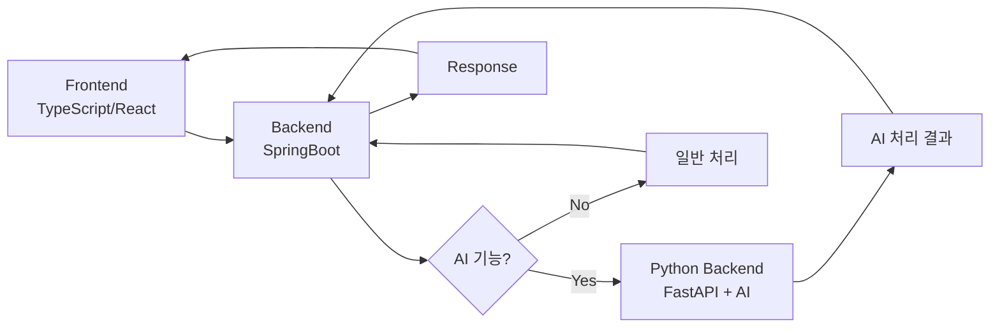

# MOZARA - 모발 손상 분석 시스템

## 🏗️ 시스템 아키텍처

### 📊 전체 구조도



### 🔄 요청 처리 흐름

#### 1️⃣ **AI 기능 요청 시**
```
[Frontend] 
    ↓ (사용자 요청)
[SpringBoot Backend] 
    ↓ (AI 기능 판별)
[Python Backend]
    ↓ (AI 모델 처리)
[SpringBoot Backend]
    ↓ (결과 수신)
[Frontend]
    (결과 표시)
```

#### 2️⃣ **일반 기능 요청 시**
```
[Frontend]
    ↓ (사용자 요청)
[SpringBoot Backend]
    ↓ (직접 처리)
[Frontend]
    (결과 표시)
```

## 🛠️ 기술 스택

### Frontend
- **Language**: TypeScript
- **Framework**: React
- **Styling**: Tailwind CSS
- **State Management**: Redux Toolkit

### Backend (Main - Spring Boot)
- **Language**: Java
- **Framework**: Spring Boot
- **Security**: Spring Security + JWT
- **Architecture**: RESTful API, MVC Pattern
- **Build Tool**: Gradle
- **Containerization**: Docker

### Backend (AI - FastAPI)
- **Language**: Python
- **Framework**: FastAPI
- **AI/ML Services**:
  - **CLIP Model**: 이미지 벡터화 및 유사도 검색
  - **Gemini API**: RAG 기반 답변 생성 및 이미지 생성
  - **Pinecone**: 벡터 데이터베이스 (모발 손상 분석)
- **Architecture**: Microservice, API Gateway Pattern
- **Containerization**: Docker

## 📁 프로젝트 구조

```
project/
├── frontend/                         # React (TypeScript)
│   ├── src/
│   │   ├── api/           # API 통신
│   │   ├── components/    # 공통 컴포넌트
│   │   ├── features/      # 기능별 모듈
│   │   │   └── selfcheck/ # BASP 자가진단
│   │   │       └── components/
│   │   ├── page/          # 페이지 컴포넌트
│   │   ├── service/       # API 서비스
│   │   ├── store/         # Redux 상태 관리
│   │   ├── style/         # 스타일 파일
│   │   ├── user/          # 사용자 관련
│   │   └── ...
│   └── package.json
│
├── backend/
│   ├── springboot/        # 메인 백엔드 (Spring Boot)
│   │   ├── src/
│   │   │   └── main/
│   │   │       ├── java/
│   │   │       │   └── com/example/springboot/
│   │   │       │       ├── component/     # 보안 컴포넌트
│   │   │       │       ├── config/        # 설정
│   │   │       │       ├── controller/    # REST 컨트롤러
│   │   │       │       │   └── ai/        # AI 관련 컨트롤러
│   │   │       │       ├── data/          # 데이터 계층
│   │   │       │       │   ├── dao/       # 데이터 접근 객체
│   │   │       │       │   ├── dto/       # 데이터 전송 객체
│   │   │       │       │   ├── entity/    # 엔티티
│   │   │       │       │   └── repository/ # 리포지토리
│   │   │       │       ├── exception/     # 예외 처리
│   │   │       │       ├── jwt/           # JWT 인증
│   │   │       │       ├── service/       # 비즈니스 로직
│   │   │       │       └── SpringbootApplication.java
│   │   │       └── resources/
│   │   │           └── application.properties
│   │   ├── build.gradle
│   │   ├── Dockerfile
│   │   └── gradlew
│   │
│   └── python/            # AI 백엔드 (FastAPI)
│       ├── app.py         # FastAPI 메인 애플리케이션
│       ├── basp.py        # BASP 자가진단 모듈
│       ├── requirements.txt
│       ├── Dockerfile
│       ├── pinecone_data/ # Pinecone 벡터 DB 관련
│       └── services/      # AI 서비스 모듈들
│           ├── basp_selfcheck/     # BASP 자가진단
│           ├── hair_change/        # 머리스타일 변경
│           └── hair_damage_analysis/ # 모발 손상 분석
│               ├── api/            # API 라우터
│               ├── data/           # 데이터 처리
│               ├── models/         # 데이터 모델
│               ├── services/       # 비즈니스 로직
│               ├── utils/          # 유틸리티
│               └── import_real_hair_data.py
│
├── database/                        # (선택) DB 초기화/마이그레이션
│   └── init.sql
│
└── docker-compose.yml               # 컨테이너 오케스트레이션
```

## 🔑 핵심 기능

### AI 기능
- **모발 손상 분석**: 이미지 업로드 → AI 분석 → 손상 유무 판단
  - CLIP 모델을 통한 이미지 벡터화
  - Pinecone 벡터 DB에서 유사 사례 검색
  - Gemini API를 통한 RAG 기반 분석 결과 생성
  - 의료 면책 조항 포함
- **머리스타일 변경**: 이미지 업로드 → AI 스타일 변경 → 결과 이미지 생성
  - Gemini API를 통한 이미지 생성
  - 12가지 헤어스타일 옵션 제공
  - 결과 이미지 다운로드 기능
- **BASP 자가진단**: 탈모 위험도 AI 분석
  - 모발 밀도, 헤어라인, 정수리 상태 평가
  - 생활습관 기반 위험도 분석
  - RAG 기반 개인화된 가이드 제공

### 🆕 탈모 제품 추천 기능
- **단계별 제품 추천**: BASP 진단 결과 기반 맞춤형 제품 추천
  - 1-6단계 탈모별 특화 제품 데이터베이스
  - 각 단계별 3-4개 전문 제품 추천
  - 제품 상세 정보 (가격, 평점, 성분, 적합 단계)
- **사용자 경험 개선**:
  - 즐겨찾기 제품 저장 (Redux Persist)
  - 최근 조회 제품 히스토리
  - 제품 조회 패턴 분석
  - BASP 진단과 연동된 자동 추천

### 사용자 기능
- **사용자 인증**: JWT 기반 로그인/회원가입
- **데이터 관리**: 사용자 정보 CRUD
- **보안**: Spring Security 적용
- **토큰 관리**: JWT 토큰 재발급 기능

### UI/UX 기능
- **반응형 디자인**: Tailwind CSS 기반 모바일/데스크톱 지원
- **중첩 라우팅**: React Router를 통한 페이지 구조
- **상태 관리**: Redux Toolkit을 통한 전역 상태 관리
- **API 통신**: Axios 기반 RESTful API 통신

## 🚀 실행 방법

### Frontend
```bash
cd frontend
npm install --legacy-peer-deps
npm start
```

### SpringBoot Backend
```bash
cd backend/springboot
./gradlew bootRun
```

### Python Backend
```bash
cd backend/python
pip install -r requirements.txt
python app.py
```

### Docker Compose (전체 실행)
```bash
docker-compose up -d
```

## 🔐 환경 변수

### Backend 환경 변수 (`.env`)
```env
# API Keys
ELEVEN_ST_API_KEY=your_eleven_st_api_key_here
YOUTUBE_API_KEY=your_youtube_api_key_here

# API Configuration
API_BASE_URL=http://localhost:8080/api

# Server Configuration
HOST=0.0.0.0
PORT=8000

# CORS Configuration
CORS_ORIGINS=http://localhost:3000,http://127.0.0.1:3000,http://localhost:3001,http://127.0.0.1:3001

# AI Service Keys (if using AI features)
PINECONE_API_KEY=your_pinecone_key
GEMINI_API_KEY=your_gemini_key
```

### `application.properties` (SpringBoot)
```properties
spring.datasource.url=jdbc:mysql://localhost:3306/mozara
jwt.secret=your_jwt_secret
```

## 📡 API 엔드포인트

### 탈모 제품 추천 API
- **GET** `/api/products?stage={1-6}` - 탈모 단계별 제품 조회
- **GET** `/api/config` - 환경변수 설정 조회
- **GET** `/health` - 서버 상태 확인

### 응답 예시
```json
{
  "products": [
    {
      "productId": "product_001",
      "productName": "탈모 예방 샴푸",
      "productPrice": 25000,
      "productRating": 4.5,
      "productReviewCount": 1200,
      "productImage": "https://example.com/image.jpg",
      "productUrl": "https://example.com/product",
      "mallName": "11번가",
      "maker": "제조사",
      "brand": "브랜드명",
      "category1": "헤어케어",
      "category2": "샴푸",
      "category3": "탈모예방",
      "category4": "두피케어",
      "description": "탈모 예방에 특화된 샴푸",
      "ingredients": ["케토코나졸", "비오틴", "아연"],
      "suitableStages": [1, 2]
    }
  ],
  "totalCount": 3,
  "stage": 1,
  "stageDescription": "초기 탈모 (예방 중심)",
  "recommendation": "1단계 탈모에 적합한 3개 제품을 추천합니다.",
  "disclaimer": "본 추천은 참고용이며, 정확한 진단과 치료는 전문의 상담이 필요합니다."
}
```

## 👥 팀 정보
- **프로젝트명**: MOZARA
- **팀명**: TeamDND
- **GitHub**: https://github.com/TeamDND/MOZARA
