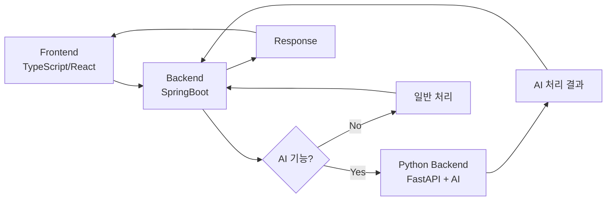

# MOZARA - 모발 손상 분석 시스템

## 🏗️ 시스템 아키텍처

### 📊 전체 구조도


```mermaid
graph LR
    A[Frontend<br/>TypeScript/React] --> B[Backend<br/>SpringBoot]
    B --> C{AI 기능?}
    C -->|Yes| D[Python Backend<br/>FastAPI + AI]
    C -->|No| E[일반 처리]
    D --> F[AI 처리 결과]
    F --> B
    E --> B
    B --> G[Response]
    G --> A
```

### 🔄 요청 처리 흐름

#### 1️⃣ **AI 기능 요청 시**
```
[Frontend] 
    ↓ (사용자 요청)
[SpringBoot Backend] 
    ↓ (AI 기능 판별)
[Python Backend]
    ↓ (AI 모델 처리)
[SpringBoot Backend]
    ↓ (결과 수신)
[Frontend]
    (결과 표시)
```

#### 2️⃣ **일반 기능 요청 시**
```
[Frontend]
    ↓ (사용자 요청)
[SpringBoot Backend]
    ↓ (직접 처리)
[Frontend]
    (결과 표시)
```

## 🛠️ 기술 스택

### Frontend
- **Language**: TypeScript
- **Framework**: React
- **Styling**: Tailwind CSS
- **State Management**: Redux Toolkit

### Backend (Main)
- **Language**: Java
- **Framework**: Spring Boot
- **Security**: Spring Security + JWT
- **Database**: MySQL/PostgreSQL

### Backend (AI)
- **Language**: Python
- **Framework**: FastAPI
- **AI/ML**: 
  - CLIP Model (이미지 벡터화)
  - Gemini API (RAG 답변 생성)
- **Vector DB**: Pinecone

## 📁 프로젝트 구조

```
project/
├── frontend/               # TypeScript React 앱
│   ├── src/
│   │   ├── api/           # API 통신
│   │   ├── page/          # 페이지 컴포넌트
│   │   ├── user/          # 사용자 관련
│   │   ├── store/         # Redux 상태 관리
│   │   └── style/         # 스타일 파일
│   └── package.json
│
├── backend/
│   ├── springboot/        # 메인 백엔드
│   │   └── src/
│   │       └── main/
│   │           └── java/
│   │               └── com/example/springboot/
│   │                   ├── controller/
│   │                   ├── service/
│   │                   └── jwt/
│   │
│   └── python/            # AI 백엔드
│       ├── app.py         # FastAPI 메인
│       ├── pinecone_service/
│       └── requirements.txt
│
└── docker-compose.yml     # 컨테이너 오케스트레이션
```

## 🔑 핵심 기능

### AI 기능
- **모발 손상 분석**: 이미지 업로드 → AI 분석 → 손상 유무 판단
- **RAG 기반 답변**: Pinecone 벡터 검색 + Gemini LLM
- **유사 사례 검색**: CLIP 모델을 통한 이미지 유사도 검색

### 일반 기능
- **사용자 인증**: JWT 기반 로그인/회원가입
- **데이터 관리**: 사용자 정보 CRUD
- **보안**: Spring Security 적용

## 🚀 실행 방법

### Frontend
```bash
cd frontend
npm install --legacy-peer-deps
npm start
```

### SpringBoot Backend
```bash
cd backend/springboot
./gradlew bootRun
```

### Python Backend
```bash
cd backend/python
pip install -r requirements.txt
python app.py
```

### Docker Compose (전체 실행)
```bash
docker-compose up -d
```

## 🔐 환경 변수

### `.env` (Python)
```env
PINECONE_API_KEY=your_pinecone_key
GEMINI_API_KEY=your_gemini_key
```

### `application.properties` (SpringBoot)
```properties
spring.datasource.url=jdbc:mysql://localhost:3306/mozara
jwt.secret=your_jwt_secret
```

## 👥 팀 정보
- **프로젝트명**: MOZARA
- **팀명**: TeamDND
- **GitHub**: https://github.com/TeamDND/MOZARA
