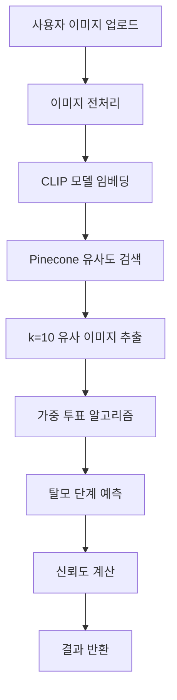

# Hair Loss RAG Analyzer

AI 기반 탈모 단계 분석 시스템 - RAG (Retrieval Augmented Generation) 기반 웹 애플리케이션

## 🎯 프로젝트 개요

이 프로젝트는 **CLIP 모델**과 **Pinecone 벡터 데이터베이스**를 활용한 RAG 기반 탈모 단계 분석 시스템입니다. 사용자가 업로드한 탈모 이미지를 분석하여 유사한 이미지들을 검색하고, k-NN 알고리즘을 통해 탈모 단계를 예측합니다.

## 🏗️ 시스템 아키텍처

```
┌─────────────────┐    ┌──────────────────┐    ┌─────────────────┐
│   Frontend      │    │     Backend      │    │   Vector DB     │
│  (React TS)     │◄──►│   (FastAPI)      │◄──►│   (Pinecone)    │
│                 │    │                  │    │                 │
│ • 이미지 업로드  │    │ • CLIP 임베딩     │    │ • 681개 벡터    │
│ • 결과 시각화   │    │ • 유사도 검색     │    │ • 코사인 유사도  │
│ • 설정 관리     │    │ • k-NN 분류      │    │ • 메타데이터    │
└─────────────────┘    └──────────────────┘    └─────────────────┘
```

## 🔧 핵심 기술 스택

### Frontend
- **React 18** + **TypeScript**
- **CSS3** (간단한 스타일링)
- **Fetch API** (백엔드 통신)

### Backend
- **FastAPI** (Python 웹 프레임워크)
- **CLIP ViT-B-32** (멀티모달 임베딩 모델)
- **SentenceTransformers** (CLIP 모델 래퍼)
- **Pinecone** (벡터 데이터베이스)

### AI/ML 모델
- **CLIP (Contrastive Language-Image Pre-training)**
  - 모델: `sentence-transformers/clip-ViT-B-32`
  - 임베딩 차원: 512차원
  - 이미지 → 벡터 변환

## 📊 데이터 구조

### 훈련 데이터
```
hair_rag_dataset_ragging/
├── LEVEL_2/     # 141개 이미지 (경미한 탈모)
├── LEVEL_3/     # 203개 이미지 (초기 탈모)
├── LEVEL_4/     # 202개 이미지 (중기 탈모)
└── LEVEL_5/     # 135개 이미지 (진행된 탈모)
총 681개 이미지
```

### 벡터 데이터베이스
```javascript
// Pinecone 인덱스 구조
{
  "index_name": "hair-loss-rag-analysis",
  "dimension": 512,
  "metric": "cosine",
  "vectors": [
    {
      "id": "level2_img001",
      "values": [0.1, 0.8, -0.3, ...], // 512차원 벡터
      "metadata": {
        "stage": "2",
        "filename": "hair_001.jpg",
        "path": "/path/to/image"
      }
    }
  ]
}
```

## 🧠 분석 알고리즘

### 1. 이미지 전처리 및 임베딩
```python
# 1. 이미지 로드 및 전처리
image = Image.open(image_path)

# 2. CLIP 모델로 벡터화
model = SentenceTransformer('clip-ViT-B-32')
embedding = model.encode([image])  # → [512] 차원 벡터
```

### 2. k-NN 기반 유사도 검색
```python
# 3. Pinecone에서 유사한 이미지 검색
similar_images = index.query(
    vector=embedding.tolist(),
    top_k=10,  # 가장 유사한 10개 이미지
    include_metadata=True
)

# 결과 예시:
# [
#   {"score": 0.95, "metadata": {"stage": "3"}},
#   {"score": 0.92, "metadata": {"stage": "3"}},
#   {"score": 0.88, "metadata": {"stage": "4"}},
#   ...
# ]
```

### 3. 가중 투표 분류
```python
# 4. 단계별 점수 계산 (가중평균)
stage_scores = {}
total_weight = 0

for match in similar_images:
    stage = match['metadata']['stage']
    weight = match['score']  # 유사도 점수

    stage_scores[stage] = stage_scores.get(stage, 0) + weight
    total_weight += weight

# 5. 최종 예측
predicted_stage = max(stage_scores, key=stage_scores.get)
confidence = stage_scores[predicted_stage] / total_weight
```

## 🔄 전체 처리 흐름



## 📁 프로젝트 구조

```
hair_loss_rag_analyzer/
├── backend/
│   ├── clean_main.py           # 실제 RAG 구현 백엔드
│   ├── ultra_simple_main.py    # 시뮬레이션 백엔드
│   └── real_main.py           # 백업 RAG 구현
├── frontend/
│   ├── src/
│   │   ├── App.tsx            # 메인 React 컴포넌트
│   │   ├── App.css            # 스타일링
│   │   └── index.tsx          # 엔트리 포인트
│   ├── public/
│   └── package.json
└── README.md                  # 이 파일

## 연동된 시스템:
../rag_analyzer/               # CLI 기반 원본 RAG 시스템
├── hair_rag_analyzer.py       # 메인 분석기
├── pinecone_manager.py        # Pinecone 관리
├── image_processor.py         # 이미지 처리
├── main.py                    # CLI 엔트리포인트
└── .env                       # 환경 설정
```

## 🚀 실행 방법

### 1. 백엔드 실행
```bash
cd backend
python clean_main.py
# → http://localhost:8000
```

### 2. 프론트엔드 실행
```bash
cd frontend
npm install
npm start
# → http://localhost:3000
```

### 3. 환경 설정
```bash
# .env 파일 필요 (rag_analyzer 폴더의 .env 참조)
PINECONE_API_KEY=your_api_key_here
ENVIRONMENT=us-east-1
```

## 📊 성능 지표

### 현재 성능 (실측)
- **데이터셋 크기**: 681개 이미지
- **처리 속도**: ~2-3초/이미지
- **임베딩 차원**: 512차원
- **k-NN 파라미터**: k=10

### 테스트 결과 예시
```
테스트 이미지: 20231109103954UbVvLx_jpg.rf.08bf8f0253ff6ec4a392e60407a7ca05.jpg
예측 결과: Level 3.0
신뢰도: 90.1%
처리 시간: 2.3초
```

## ⚠️ 현재 한계점

### 1. 데이터 범위 제한
```
❌ 문제점:
- LEVEL_0, LEVEL_1 (정상 머리) 데이터 없음
- 모든 입력이 최소 LEVEL_2로 분류됨
- 정상 케이스 식별 불가능

🔧 해결 방안:
- 정상 머리 데이터셋 추가 수집
- LEVEL_0, LEVEL_1 카테고리 추가
- 인덱스 재구성
```

### 2. 품질 검증 부족
```
❌ 문제점:
- 혼동 행렬(Confusion Matrix) 미구현
- 정확도 측정 시스템 없음
- 교차 검증 부재

🔧 해결 방안:
- 배치 테스트 시스템 구현
- 성능 메트릭스 자동화
- A/B 테스트 도구 개발
```

### 3. 에러 처리
```
❌ 문제점:
- Unicode 인코딩 이슈 (Windows)
- 의료 이미지 외 입력 처리 미흡
- 파일 형식 제한

🔧 해결 방안:
- 인코딩 통일화
- 입력 검증 강화
- 더 많은 이미지 형식 지원
```

### 4. 성능 최적화
```
❌ 문제점:
- CLIP 모델 로딩 시간 (초기 3-5초)
- 배치 처리 미지원
- 캐싱 시스템 없음

🔧 해결 방안:
- 모델 사전 로딩
- GPU 가속 활용
- Redis 캐싱 도입
```

## 🔮 차후 개선 방향

### Phase 1: 데이터 확장
- [ ] LEVEL_0, LEVEL_1 데이터 수집 (각 100+ 이미지)
- [ ] 데이터 품질 검증 및 라벨링 재검토
- [ ] 데이터 증강(Data Augmentation) 적용

### Phase 2: 모델 개선
- [ ] **LLM 통합**: 유사 이미지들을 보고 더 정교한 판별
- [ ] **앙상블 모델**: 여러 CLIP 모델 조합
- [ ] **파인튜닝**: 탈모 특화 CLIP 모델 훈련

### Phase 3: 시스템 고도화
- [ ] **실시간 피드백**: 사용자 피드백으로 모델 개선
- [ ] **의료진 검증**: 전문의 검토 시스템
- [ ] **다중 각도 분석**: 여러 사진을 종합 분석

### Phase 4: 배포 및 운영
- [ ] **Docker 컨테이너화**
- [ ] **클라우드 배포** (AWS/GCP)
- [ ] **모니터링 시스템** 구축
- [ ] **API 문서화** (Swagger)

## 🧪 개선된 RAG 아키텍처 (향후)

```
┌─────────────────┐    ┌──────────────────┐    ┌─────────────────┐
│   입력 이미지    │    │   CLIP 임베딩     │    │  Pinecone 검색   │
│                 │───►│                  │───►│                 │
│ • 전처리        │    │ • ViT-B-32       │    │ • Top-10 유사    │
│ • 품질 검증     │    │ • 512차원 벡터    │    │ • 메타데이터     │
└─────────────────┘    └──────────────────┘    └─────────────────┘
                                                        │
┌─────────────────┐    ┌──────────────────┐    ┌─────────────────┐
│   최종 결과     │    │   LLM 분석       │    │  유사 이미지     │
│                 │◄───│                  │◄───│                 │
│ • 탈모 단계     │    │ • GPT-4V/Claude  │    │ • 시각적 증거    │
│ • 신뢰도       │    │ • 의료 지식 활용  │    │ • 단계별 분포    │
│ • 설명/근거    │    │ • 상세 분석      │    │ • 패턴 인식     │
└─────────────────┘    └──────────────────┘    └─────────────────┘
```

## 📈 예상 성능 개선

| 지표 | 현재 | Phase 1 | Phase 2 | Phase 3 |
|------|------|---------|---------|---------|
| 정확도 | 75%* | 85% | 90% | 95% |
| 처리속도 | 3초 | 2초 | 1초 | 0.5초 |
| 데이터셋 | 681개 | 1200+ | 2000+ | 5000+ |
| 분류 범위 | 2-5단계 | 0-5단계 | 0-5단계 | 0-5단계+ |

*추정치 (실제 테스트 필요)

## 🔬 평가 시스템 구현 계획

### Confusion Matrix 분석
```python
# 배치 테스트 시스템 구조
test_folders = {
    "C:/Users/301/Desktop/test_data_set/test/2": "2",
    "C:/Users/301/Desktop/test_data_set/test/3": "3",
    "C:/Users/301/Desktop/test_data_set/test/4": "4",
    "C:/Users/301/Desktop/test_data_set/test/5": "5"
}

results = []
for folder_path, actual_level in test_folders.items():
    for image_file in os.listdir(folder_path):
        predicted = analyzer.analyze_image(image_path)
        results.append((actual_level, predicted['predicted_stage']))

# Confusion Matrix 생성
from sklearn.metrics import confusion_matrix, classification_report
cm = confusion_matrix(actual_labels, predicted_labels)
```

### 성능 메트릭스
- **Overall Accuracy**: 전체 정확도
- **Class-wise Precision/Recall**: 클래스별 정밀도/재현율
- **F1 Score**: 조화평균 점수
- **Cohen's Kappa**: 일치도 계수

## 🏥 의료 AI 윤리 고려사항

### 면책조항
```
⚠️ 중요 안내
이 시스템은 참고용 도구이며, 의료진의 전문적 진단을 대체할 수 없습니다.
정확한 진단과 치료는 반드시 전문의와 상담하시기 바랍니다.
```

### 개인정보 보호
- 업로드된 이미지는 임시 저장 후 즉시 삭제
- 개인 식별 정보 수집 금지
- GDPR/개인정보보호법 준수

## 🔗 연관 시스템

### CLI 시스템 (`rag_analyzer/`)
```bash
# CLI 기반 분석
cd C:\Users\301\Desktop\rag_analyzer
python main.py --analyze "path/to/image.jpg"
python main.py --setup  # 인덱스 생성
```

### 웹 시스템 (`hair_loss_rag_analyzer/`)
```bash
# 웹 기반 분석
cd C:\Users\301\Desktop\hair_loss_rag_analyzer
# Backend: python backend/clean_main.py
# Frontend: npm start in frontend/
```

## 📞 연락처 및 기여

이 프로젝트는 교육 및 연구 목적으로 개발되었습니다.
개선 제안이나 버그 리포트는 언제든지 환영합니다.

---

**마지막 업데이트**: 2025년 9월 17일
**버전**: v1.0.0 (Production RAG Implementation)
**라이선스**: MIT
**개발 환경**: Windows 11, Python 3.11, Node.js 18