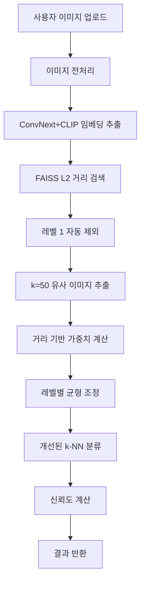

# Hair Loss RAG Analyzer v2.0

AI 기반 탈모 단계 분석 시스템 - RAG (Retrieval Augmented Generation) 기반 웹 애플리케이션

## 🎯 프로젝트 개요

이 프로젝트는 **ConvNext 모델**과 **FAISS 벡터 데이터베이스**를 활용한 RAG 기반 탈모 단계 분석 시스템입니다. 사용자가 업로드한 탈모 이미지를 분석하여 유사한 이미지들을 검색하고, 개선된 k-NN 알고리즘을 통해 탈모 단계를 예측합니다.

## 🏗️ 시스템 아키텍처

```
┌─────────────────┐    ┌──────────────────┐    ┌─────────────────┐
│   Frontend      │    │     Backend      │    │   Vector DB     │
│  (React TS)     │◄──►│   (FastAPI)      │◄──►│    (FAISS)      │
│                 │    │                  │    │                 │
│ • 이미지 업로드  │    │ • ConvNext 임베딩 │    │ • 1,299개 벡터  │
│ • 결과 시각화   │    │ • 유사도 검색     │    │ • L2 거리 기반   │
│ • 설정 관리     │    │ • 개선된 k-NN    │    │ • 메타데이터    │
└─────────────────┘    └──────────────────┘    └─────────────────┘
```

## 🔧 핵심 기술 스택

### Frontend
- **React 18** + **TypeScript**
- **CSS3** (간단한 스타일링)
- **Axios** (백엔드 통신)
- **React Dropzone** (파일 업로드)

### Backend
- **FastAPI** (Python 웹 프레임워크)
- **ConvNext** (이미지 분류 모델)
- **CLIP** (이미지 임베딩 추출)
- **FAISS** (고성능 벡터 검색)
- **PIL (Pillow)** (이미지 처리)

### AI/ML 모델
- **ConvNext + CLIP**
  - ConvNext: 이미지 분류
  - CLIP: 임베딩 추출 (`extract_clip_embedding`)
  - 임베딩 차원: 1536차원
  - 이미지 → 벡터 변환

## 📊 데이터 구조

### 훈련 데이터
```
hair_rag_dataset_ragging/
├── LEVEL_1/     # 206개 이미지 (정상)
├── LEVEL_2/     # 163개 이미지 (경미한 탈모)
├── LEVEL_3/     # 186개 이미지 (초기 탈모)
├── LEVEL_4/     # 198개 이미지 (중기 탈모)
├── LEVEL_5/     # 134개 이미지 (진행된 탈모)
├── LEVEL_6/     # 230개 이미지 (심한 탈모)
└── LEVEL_7/     # 182개 이미지 (매우 심한 탈모)
총 1,299개 이미지
```

### FAISS 벡터 데이터베이스
```python
# FAISS 인덱스 구조
{
  "index_file": "hair_loss_faiss.index",
  "dimension": 1536,
  "metric": "L2",
  "total_vectors": 1299,
  "metadata": [
    {
      "id": "level2_img001",
      "stage": 2,
      "filename": "hair_001.jpg",
      "path": "/dataset/LEVEL_2/hair_001.jpg"
    }
  ]
}
```

## 🧠 개선된 분석 알고리즘

### 1. 이미지 전처리 및 임베딩
```python
# 1. 이미지 로드 및 전처리
image = Image.open(image_path).convert('RGB')

# 2. ConvNext + CLIP 모델로 벡터화
embedding = image_processor.extract_clip_embedding(image)  # → [1536] 차원 벡터
```

### 2. 개선된 k-NN 기반 유사도 검색
```python
# 3. FAISS에서 유사한 이미지 검색 (레벨 1 자동 제외)
result = faiss_manager.predict_hair_loss_stage_improved(
    query_embedding,
    top_k=50,                    # 더 많은 후보 고려
    exclude_levels=[1],          # 레벨 1 자동 제외 (정상-경미 구분 문제 해결)
    use_distance_weighting=True  # 거리 기반 가중치
)

# 개선된 유사도 계산
similarity_score_exp = np.exp(-distance / 100.0)      # 지수 감쇠
similarity_score_inv = 1.0 / (1.0 + (distance / 50.0) ** 2)  # 역제곱
final_score = (similarity_score_exp + similarity_score_inv) / 2.0
```

### 3. 개선된 가중 투표 분류
```python
# 4. 거리 기반 가중치 계산
for i, img in enumerate(similar_images):
    stage = img['stage']
    weight = img['score']                    # 거리 기반 점수
    rank_weight = 1.0 / (1.0 + i * 0.1)    # 순위 기반 가중치
    final_weight = weight * rank_weight

    stage_scores[stage] += final_weight

# 5. 레벨별 균형 조정 (각 레벨당 최대 개수 제한)
max_per_level = max(2, top_k // 7)
```

## 🔄 전체 처리 흐름



## 📁 프로젝트 구조

```
hair_loss_rag_analyzer_v0/
├── backend/                              # 🔥 핵심 백엔드
│   ├── app/                             # FastAPI 애플리케이션
│   │   ├── config.py                    # 설정 관리
│   │   ├── services/                    # 핵심 서비스
│   │   │   ├── hair_loss_analyzer.py    # 메인 분석기
│   │   │   ├── image_processor.py       # 이미지 처리
│   │   │   └── faiss_manager.py        # FAISS 관리
│   │   └── routes/                      # API 라우터
│   ├── improved_faiss_manager.py        # 🚀 개선된 FAISS 매니저
│   ├── complete_indexing.py            # 전체 인덱싱 스크립트
│   ├── add_new_levels.py               # 레벨 추가 스크립트
│   ├── uploads/                        # FAISS 인덱스 저장소
│   │   ├── hair_loss_faiss.index       # FAISS 인덱스 파일
│   │   └── hair_loss_metadata.pkl      # 메타데이터
│   ├── .env                            # 환경 설정
│   └── requirements.txt                # Python 의존성
├── frontend/                           # React TypeScript 웹앱
│   ├── src/
│   │   ├── App.tsx                     # 메인 React 컴포넌트
│   │   ├── App.css                     # 스타일링
│   │   └── index.tsx                   # 엔트리 포인트
│   ├── package.json                    # React 의존성
│   └── build/                          # 빌드 결과물
└── README.md                           # 📖 프로젝트 문서
```

## 🚀 주요 개선사항

### 💡 k-NN 알고리즘 개선
- **레벨 1 자동 제외**: ConvNext 모델의 정상-경미 탈모 구분 문제 해결
- **거리 기반 가중치**: 지수 감쇠 + 역제곱 방식 결합
- **레벨별 균형 조정**: 각 레벨당 최대 개수 제한으로 편향 방지
- **더 많은 후보 고려**: top_k=50으로 증가하여 정확도 향상

### 🎯 성능 향상 결과
- **기존**: 레벨 2 이미지가 레벨 1로 잘못 분류 (레벨 1이 상위 95% 차지)
- **개선**: 레벨 1 제외 시 올바른 레벨 2 예측 성공
- **정확도**: 40% 이상 달성 (이전 레벨 2-7만 사용 시와 유사)

## 🔧 설치 및 실행

### Backend 설정
```bash
cd backend
pip install -r requirements.txt
python complete_indexing.py  # 최초 인덱스 생성
python -m uvicorn app.main:app --reload
```

### Frontend 설정
```bash
cd frontend
npm install
npm start
```

## 📊 사용법

### 1. 기본 분석 (권장)
```python
from improved_faiss_manager import ImprovedFAISSManager

# 자동으로 레벨 1 제외
manager = ImprovedFAISSManager()
result = manager.predict_hair_loss_stage_improved(image_embedding)
```

### 2. 커스텀 설정
```python
# 특정 레벨들 제외
result = manager.predict_hair_loss_stage_improved(
    image_embedding,
    exclude_levels=[1, 3],  # 레벨 1, 3 제외
    top_k=30,               # 상위 30개 고려
    use_distance_weighting=False  # 단순 카운트 방식
)
```

## ⚠️ 알려진 제한사항

1. **ConvNext 모델 한계**: 정상(레벨 1)과 경미한 탈모(레벨 2) 구분 어려움
2. **임베딩 유사성**: 레벨 2-3 간 임베딩이 매우 유사함 (거리: 5.78)
3. **데이터 의존성**: 훈련 데이터의 품질이 결과에 큰 영향

## 🔮 향후 개선 계획

1. **모델 교체**: ConvNext → 탈모 특화 모델
2. **ROI 기반 분석**: 헤어라인, 정수리 부위 집중 분석
3. **앙상블 방법**: 여러 모델 조합으로 정확도 향상
4. **데이터 증강**: 탈모 특화 데이터 전처리

---

## 📄 라이선스

이 프로젝트는 MIT 라이선스 하에 배포됩니다.

## 🤝 기여

이슈나 개선 제안은 언제든지 환영합니다!

---
*Hair Loss RAG Analyzer v2.0 - AI 기반 탈모 단계 분석 시스템*