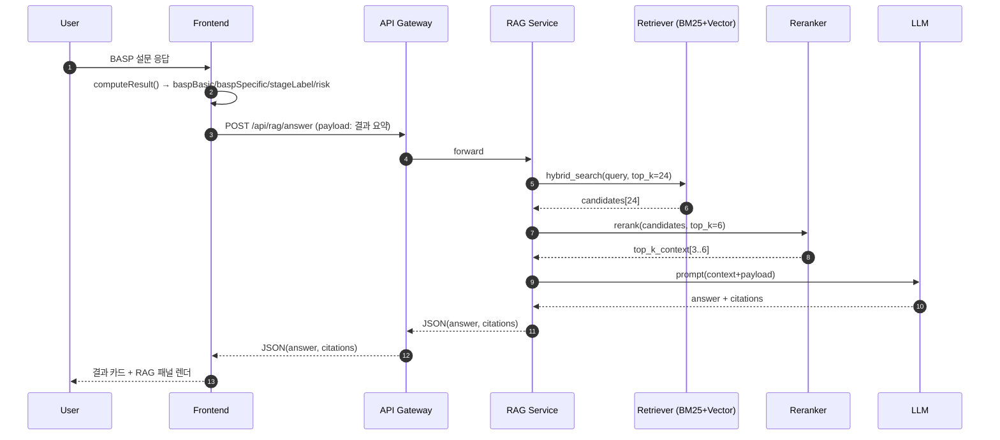

# basp_rag_flow.md

> 목적: **BASP 자가진단 결과**에 **RAG(Retrieval‑Augmented Generation)**를 결합하여, 사용자 단계/패턴에 맞춘 **근거 기반 가이드**를 제공한다. (의료 진단이 아닌 참고용)

---

## 0) 한눈에 보는 흐름

1. **Self‑check**: BASP 간소화 설문 → `computeResult()`로 `baspBasic`, `baspSpecific`, `stageLabel`, `riskScore` 산출  
2. **Query Build**: 결과값을 바탕으로 RAG 검색 쿼리 템플릿 생성  
3. **Retrieval**: **하이브리드 검색**(BM25 + Vector) → 후보 청크 24개  
4. **Rerank**: 리랭커(bge‑reranker/Cohere Rerank)로 상위 3~6개 선택  
5. **Answer**: LLM에 컨텍스트+프롬프트 주입 → 출처 각주 달린 가이드 생성  
6. **Safety**: 의료 과장/확정 표현 필터 + 디스클레이머 주입  
7. **Render**: 결과 카드 + **RAG 패널(가이드 목록 + 출처 토글)**



---

## 1) UX 플로우 (수정본)

### 1.1 설문 단계 (동일)
- Step1: 헤어라인 A/M/C/U
- Step2: 정수리 V0~V3
- Step3: 전체 밀도 0~3
- Step4: 생활 습관(빠짐 증가, 가족력, 수면, 흡연, 음주)

### 1.2 결과 화면 (변경)
- [좌] **BASP 결과 카드**: `baspBasic`, `baspSpecific`, `stageLabel`, `summaryText`
- [우] **RAG 패널(신규)**  
  - **맞춤 가이드 목록**(3~5개): 각 항목 끝에 **각주 [n]**  
  - **출처 토글**: [1], [2] 클릭 시 **출처 카드** 확장 (title/publisher/year/snippet/“원문 보기” 링크)  
  - **의료 고지**: 하단 고정 노출

---

## 2) 데이터 모델

```ts
// 결과 요약 (기존)
type HairlineType = 'A' | 'M' | 'C' | 'U';
type VertexLevel = 0 | 1 | 2 | 3;
type DensityLevel = 0 | 1 | 2 | 3;

interface LifestyleAnswers {
  shedding6m: boolean;
  familyHistory: boolean;
  sleepHours: 'lt4' | '5to7' | 'ge8';
  smoking: boolean;
  alcohol: 'none' | 'light' | 'heavy';
}

interface SelfCheckAnswers {
  hairline: HairlineType | null;
  vertex: VertexLevel | null;
  density: DensityLevel | null;
  lifestyle: LifestyleAnswers;
}

interface BaselineResult {
  baspBasic: HairlineType;          // A/M/C/U
  baspSpecific: `V${VertexLevel}`;  // V0~V3
  stageLabel: '정상' | '초기' | '중등도' | '진행성';
  summaryText: string;
  recommendations: string[];
  disclaimers: string[];
  riskScore: number;                // 0~8 (아래 산식 참고)
}

// RAG 응답
interface RagCitation {
  n: number;          // 각주 번호
  docId: string;
  title: string;
  publisher?: string;
  year?: number;
  url?: string;
  snippet?: string;
}

interface RagAnswer {
  answer: string[];        // 각 항목 끝에 [n] 표기
  citations: RagCitation[];
}
```

---

## 3) 스코어링 (요약)

```txt
LifestyleRisk (0~8) = +2(shedding6m) +2(familyHistory) +2/1/0(sleep lt4/5-7/8+)
                      +1(smoking) +1(alcohol heavy)
riskBucket (0~2) = min(2, floor(LifestyleRisk/3))
raw (0~8) = vertex(0~3) + density(0~3) + riskBucket(0~2)
stageLabel = 0:정상, 1~2:초기, 3~5:중등도, 6~8:진행성
```

---

## 4) RAG 아키텍처

- **임베딩**: `bge-m3` 또는 `e5-large` (ko/en 멀티링구얼)  
- **벡터DB**: `pgvector` or `Qdrant`  
- **하이브리드 검색**: `score = 0.5*normalize(VectorSim) + 0.5*normalize(BM25)`  
- **리랭커**: `bge-reranker-v2` 또는 Cohere Rerank  
- **LLM**: 조직 표준(예: GPT‑4o‑mini/Claude/Gemini)  
- **캐시**: Redis (키: baspBasic+baspSpecific+stage+riskBucket, TTL 24h)

```mermaid
flowchart LR
  A[KB Raw<br/>(가이드/논문/라벨/FAQ)] --> B[정제/청크화]
  B --> C[임베딩 생성]
  C --> D[Vector DB]
  B --> E[BM25 인덱스]
  subgraph Online
    Q[Query Builder] --> H[Hybrid Search<br/>(Vector + BM25)]
    H --> Rer[Reranker]
    Rer --> Ctx[Context Builder]
    Ctx --> LLM[LLM Answerer]
  end
  D --> H
  E --> H
```

---

## 5) API 스펙

### 5.1 RAG
`POST /api/rag/answer`

**Request**
```json
{
  "baspBasic": "M",
  "baspSpecific": "V1",
  "stageLabel": "초기",
  "riskScore": 4,
  "extras": { "sex": "M", "age": 29 }
}
```

**Response**
```json
{
  "answer": [
    "미녹시딜 2~5% 외용은 초기 단계에서 고려될 수 있습니다. 초기 쉬딩이 있을 수 있습니다. [1]",
    "수면 7~8시간, 흡연·과음 제한은 진행 위험을 낮출 수 있습니다. [2]",
    "3~6개월 모니터링 후 효과 부족/부작용 시 전문의 상담을 권장합니다. [1][3]"
  ],
  "citations": [
    { "n": 1, "docId": "doc-123", "title": "Alopecia Guideline 2024", "publisher": "대한피부과학회", "year": 2024, "url": "..." },
    { "n": 2, "docId": "doc-456", "title": "Lifestyle and Hair", "publisher": "WHO", "year": 2023, "url": "..." },
    { "n": 3, "docId": "doc-789", "title": "Minoxidil Label", "publisher": "식약처", "year": 2022, "url": "..." }
  ]
}
```

### 5.2 (옵션) Self‑check 평가
`POST /api/selfcheck/evaluate` → `{ ok: true }` (기본 미저장)

---

## 6) 프롬프트 템플릿 (요약자 역할)

```text
[시스템]
당신은 근거 기반의 한국어 의료 정보 요약자입니다.
컨텍스트에서만 답하고, 각 항목 끝에 [n] 각주를 붙이세요.
확정적 치료 표현을 쓰지 말고, 의료 고지문을 반드시 포함하세요.

[컨텍스트]
{top_k_chunks_with_numeric_citations}

[사용자 상태]
BASP={baspBasic}+{baspSpecific}, 단계={stageLabel}, risk={riskScore}.

[요청]
- 실행 가능한 가이드 3~5개를 항목으로 출력
- 각 항목 1~2문장, 끝에 [n] 표기
- 마지막 줄에 “본 도구는 의료 진단이 아닌 참고용...” 고지 추가
```

---

## 7) 프론트 통합 (ResultPage)

```ts
// 의사코드
const r = computeResult(answers); // baspBasic/baspSpecific/stageLabel/riskScore
const res = await fetch('/api/rag/answer', {
  method: 'POST',
  headers: { 'Content-Type': 'application/json' },
  body: JSON.stringify(r),
});
const { answer, citations } = await res.json();
<RagPanel items={answer} sources={citations} />;
```

**RagPanel 요구사항**
- 항목 리스트에 [n] 유지
- [n] 또는 “출처 보기” 클릭 → 출처 카드 확장(title/publisher/year/snippet/URL)
- 빈 결과/오류 시 기본 가이드 표시 + 안내 문구

---

## 8) 수락 기준 (AC)

1. 동일 입력(BASP+stage+risk) → RAG 응답이 **재현 가능**(캐시/결정적 프롬프트)  
2. 답변 각 항목에 **각주 [n]**가 붙고, 토글 시 **출처 카드**가 표시됨  
3. **확정적 치료·효과 보장 표현**이 필터링됨  
4. 결과 화면 하단에 **디스클레이머**가 노출됨  
5. API p95 응답시간 ≤ **6s** (Retrieval+Rerank+LLM 포함)  
6. 모바일(375px~)에서 가독성/터치 영역 확보

---

## 9) 테스트 케이스

- M, V1, 초기, risk=5 → 미녹시딜/생활습관 출처가 상위로 노출  
- U, V3, 진행성 → 전문의 상담/치료 옵션 관련 출처가 상위  
- 흡연=Yes, 수면<4h → 생활습관 관련 각주 포함  
- 빈 지식베이스/타임아웃 → 폴백 문구 + 기본 가이드 표시

---

## 10) Cursor Tasks

1) **백엔드**  
- `/api/rag/answer` 라우트 + 서비스 + 캐시(24h)  
- 하이브리드 검색 + 리랭커 + 프롬프트 템플릿 + 안전 필터

2) **데이터**  
- `scripts/ingest.py`, `embed_upsert.py` 작성  
- KB 샘플 20~50개 PoC 인덱싱

3) **프론트**  
- `<RagPanel />` 컴포넌트 + 출처 카드 + 오류/로딩 상태

4) **품질**  
- 오프라인 평가 스크립트(hits@k, NDCG)  
- 플래그로 A/B(리랭커 on/off, 하이브리드 가중치)

---

## 11) 고지/정책

- “본 도구는 의료 진단이 아닌 참고용입니다. 증상이 지속·악화되면 전문의 상담을 권장합니다.”  
- 치료제/시술 언급 시 **라벨·가이드라인 출처** 동시 표기  
- 사용자 프라이버시: 기본 **미저장**, 저장 시 명시적 동의 및 최소화
