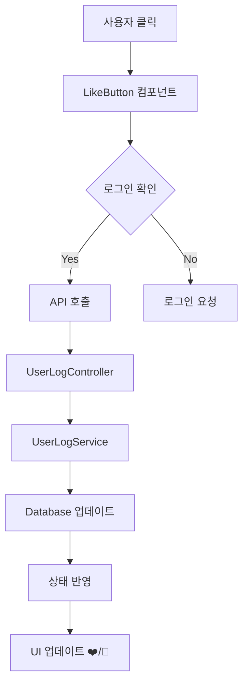

# 찜 기능 구현 문서

## 📌 개요
사용자가 YouTube 영상, 병원, 제품, 지도 서비스 등을 찜할 수 있는 통합 찜 시스템

## 🏗️ 시스템 아키텍처

### 백엔드 구조
```
Database (MySQL)
└── user_log 테이블
    ├── youtube_like (VARCHAR 255) - YouTube 영상 ID 목록
    ├── hospital_like (VARCHAR 255) - 탈모병원 ID 목록
    ├── product_like (VARCHAR 255) - 제품 ID 목록
    └── map_like (VARCHAR 255) - 지도 서비스 ID 목록
```

### API 엔드포인트
```
POST /api/userlog/{type}/like - 찜 토글
GET  /api/userlog/{type}/likes/{username} - 찜 목록 조회
GET  /api/userlog/likes/{username} - 전체 찜 목록 조회
```

## 🔄 데이터 플로우



## 🧩 주요 컴포넌트

### 1. LikeButton 컴포넌트
**위치**: `/frontend/src/components/LikeButton.tsx`

**Props**:
- `type`: 'youtube' | 'hospital' | 'product' | 'map'
- `itemId`: 고유 식별자
- `size`: 'sm' | 'md' | 'lg'
- `className`: 추가 스타일
- `onToggle`: 토글 시 콜백

**사용 예시**:
```tsx
<LikeButton
  type="product"
  itemId="prod_001"
  size="sm"
  className="bg-white/95"
/>
```

### 2. MyFavorites 컴포넌트
**위치**: `/frontend/src/pages/mypage/MyFavorites.tsx`

**기능**:
- 사용자의 모든 찜 목록 표시
- 카테고리별 탭 구분
- 찜 취소 기능
- 실시간 개수 표시

## 📊 ID 체계

| 서비스 | Type | ID 형식 | 예시 |
|--------|------|---------|------|
| YouTube | youtube | videoId | "dQw4w9WgXcQ" |
| 탈모병원 | hospital | `탈모병원-${name}` | "탈모병원-리센트클리닉" |
| 탈모미용실 | map | `탈모미용실-${name}` | "탈모미용실-헤어샵" |
| 가발전문점 | map | `가발전문점-${name}` | "가발전문점-위그샵" |
| 두피문신 | map | `두피문신-${name}` | "두피문신-SMP센터" |
| 제품 | product | productId | "11st_12345" |

## 🎯 적용 페이지

### YouTube 영상 페이지
**파일**: `/frontend/src/pages/hair_tube/YouTubeVideos.tsx`
```tsx
<LikeButton
  type="youtube"
  itemId={video.videoId}
  size="sm"
/>
```

### 제품 페이지
**파일**: `/frontend/src/pages/hair_product/ProductCard.tsx`
```tsx
<LikeButton
  type="product"
  itemId={product.productId}
  size="sm"
/>
```

### 지도 서비스 페이지
**파일**: `/frontend/src/pages/hair_map/StoreFinder.tsx`
```tsx
<LikeButton
  type={hospital.category === '탈모병원' ? 'hospital' : 'map'}
  itemId={`${hospital.category}-${hospital.name}`}
  size="sm"
/>
```

## 🔧 백엔드 구현

### Entity
**파일**: `/backend/springboot/src/main/java/com/example/springboot/data/entity/UserLogEntity.java`
```java
@Entity
@Table(name = "user_log")
public class UserLogEntity {
    @Column(name = "youtube_like")
    private String youtubeLike;

    @Column(name = "hospital_like")
    private String hospitalLike;

    @Column(name = "product_like")
    private String productLike;

    @Column(name = "map_like")
    private String mapLike;
}
```

### Service
**파일**: `/backend/springboot/src/main/java/com/example/springboot/service/user/UserLogService.java`

주요 메소드:
- `toggleYoutubeLike(username, videoId)`
- `toggleHospitalLike(username, hospitalId)`
- `toggleProductLike(username, productId)`
- `toggleMapLike(username, mapId)`

### Controller
**파일**: `/backend/springboot/src/main/java/com/example/springboot/controller/user/UserLogController.java`

## 💾 데이터 저장 형식

찜한 항목들은 콤마로 구분된 문자열로 저장:
```
youtube_like: "video1,video2,video3"
hospital_like: "탈모병원-리센트,탈모병원-모발센터"
product_like: "prod_001,prod_002"
map_like: "가발전문점-위그샵,두피문신-SMP센터"
```

## 🎨 UI/UX 특징

### 시각적 피드백
- 찜하지 않은 상태: 🤍 (흰색 하트)
- 찜한 상태: ❤️ (빨간색 하트)
- 로딩 중: 반투명 처리
- 호버 효과: 배경색 변화

### 반응형 디자인
- 모바일: `size="sm"` 사용
- 데스크톱: `size="md"` 또는 `size="lg"` 사용

## 📝 주의사항

1. **로그인 필수**: 찜 기능은 로그인한 사용자만 사용 가능
2. **ID 중복 방지**: 카테고리-이름 조합으로 고유 ID 생성
3. **문자열 길이 제한**: VARCHAR(255) 제한으로 인해 많은 항목 저장 시 주의
4. **특수문자 처리**: 이름에 콤마(,)가 포함된 경우 처리 필요

## 🚀 향후 개선사항

1. **페이지네이션**: 찜 목록이 많을 경우 페이지 분할
2. **정렬 기능**: 날짜순, 이름순 정렬
3. **검색 기능**: 찜 목록 내 검색
4. **그룹화**: 찜 목록 폴더별 관리
5. **공유 기능**: 찜 목록 공유 URL 생성